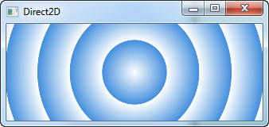
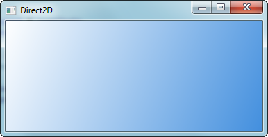
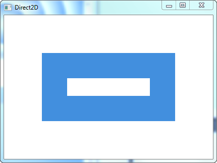

##### dx.h

```
// Created by Kenny Kerr.
// Get the latest version here: http://dx.codeplex.com
```


##### 说明

dx11的封装，仅三个头文件。

配置了VS2013工程，有机会再看。

##### RadialGradient




##### LinearGradient




##### HwndRenderTarget




